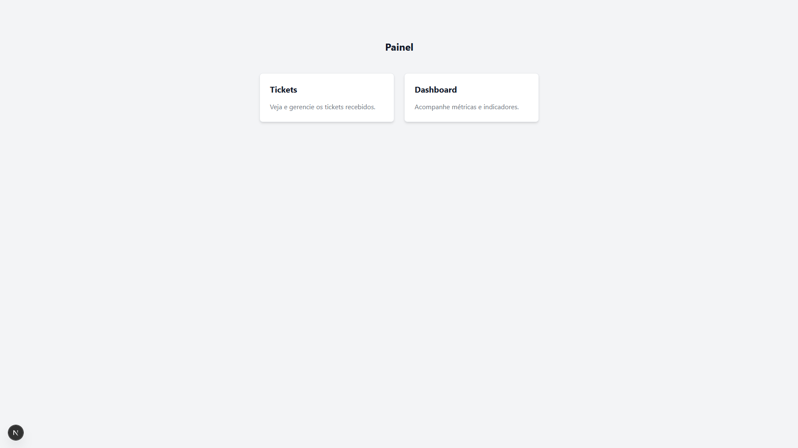
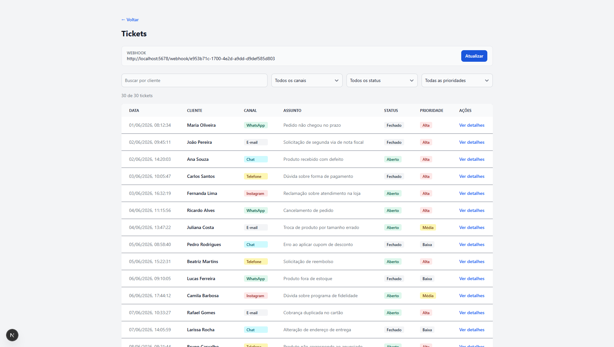
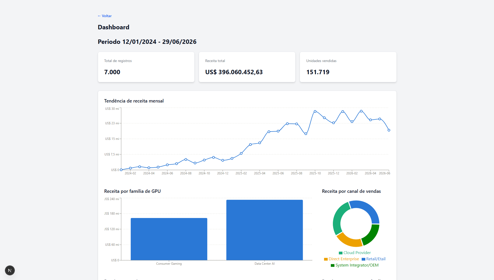

# Desafio Stalse — Frontend

Aplicação em **Next.js** que consome a API do [backend](../backend) para exibir e gerenciar os tickets de atendimento e visualizar as métricas de vendas.

- **Painel** (`/`) — atalhos para as duas telas principais;
- **Tickets** (`/tickets`) — listagem com filtros (nome do cliente, canal, status, prioridade), tela de detalhe do ticket (`/tickets/{ticket_id}`) e edição de status/prioridade, além do cadastro da URL de webhook de notificação;
- **Dashboard** (`/dashboard`) — gráficos das métricas de vendas (receita por família/modelo de GPU, região, canal de venda, segmento de cliente e tendência mensal), geradas pelo ETL em [`data/`](../data) e servidas pelo backend.

## Prints

| Painel                     | Tickets                        | Dashboard                          |
| -------------------------- | ------------------------------ | ---------------------------------- |
|  |  |  |

## Stack

- Next.js 15 (App Router) + React 19
- TypeScript
- Flowbite React + Tailwind CSS — componentes e estilos
- Recharts — gráficos do dashboard

## Pré-requisitos

- Node.js 22;
- Backend rodando (ver [backend/README.md](../backend/README.md)) — por padrão em `http://127.0.0.1:8000`.

## Como executar

```bash
# instala as dependências
npm install

# sobe o servidor de desenvolvimento com hot reload
npm run dev
```

A aplicação sobe por padrão em `http://localhost:3000`.

## Variáveis de ambiente

Copie `.env.example` para `.env` e ajuste se necessário:

```bash
BACKEND_URL=http://127.0.0.1:8000
```

`BACKEND_URL` é a base usada pelos services (`modules/services`) para chamar a API do backend (`/tickets`, `/metrics`). Se não for definida, o valor padrão acima é usado.

## Estrutura do projeto

```
app/
├── page.tsx                  # painel inicial, com atalhos para tickets e dashboard
├── layout.tsx                # layout raiz (fontes, tema Flowbite)
├── tickets/
│   ├── page.tsx                 # listagem/filtro de tickets + cadastro de webhook
│   ├── [ticket_id]/page.tsx     # detalhe de um ticket
│   └── components/              # tabela, modais de edição de ticket/webhook, etc.
└── dashboard/
    ├── page.tsx                 # tela de métricas
    └── components/               # gráficos (Recharts) por dimensão da métrica

modules/
├── enum/          # enums (status/prioridade de ticket)
├── interfaces/     # tipos (Tickets, Metrics)
├── mappers/        # conversão de dados para exibição
└── services/       # clientes HTTP para a API do backend (Tickets, Metrics)
```
