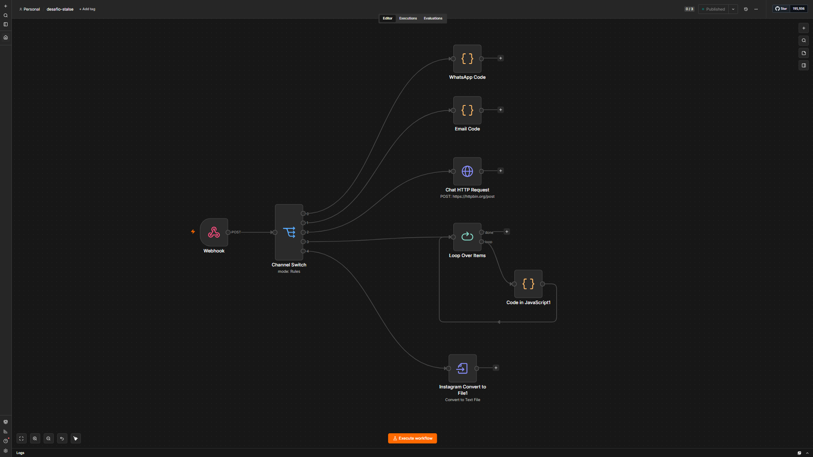

# Desafio Stalse — n8n

Instância do [n8n](https://n8n.io/) usada para simular a notificação multi-canal disparada pelo [backend](../backend) quando um ticket é atualizado para `status=closed` ou `priority=high` (ver `TicketsService._notify_webhook` em `app/tickets/service/tickets_service.py`).

O backend chama a URL cadastrada via `POST /tickets/webhook` com o corpo do ticket atualizado; esse workflow recebe esse payload e roteia a notificação de acordo com o `channel` do ticket.

## Como executar

```bash
docker compose up -d
```

A instância sobe em `http://localhost:5678`.

- **Usuário:** `admin`
- **Senha:** `admin`

(credenciais definidas em [`docker-compose.yml`](docker-compose.yml) via `N8N_BASIC_AUTH_USER`/`N8N_BASIC_AUTH_PASSWORD` — trocar antes de qualquer uso fora do ambiente local).

Os dados da instância (credenciais, workflows salvos, execuções) persistem no volume Docker `n8n_data`.

## Importando o workflow

1. Acesse `http://localhost:5678` e faça login;
2. Vá em **Workflows → Import from File** e selecione [`workflow.json`](workflow.json);
3. Ative o workflow (toggle **Active**, já vem `"active": true` no JSON);
4. Copie a URL do node **Webhook** (produção) e cadastre-a no backend, chamando `POST /tickets/webhook` com `{"url": "<url-do-webhook-n8n>"}`.

## O que o workflow faz ([`workflow.json`](workflow.json))



```
Webhook (POST) → Channel Switch (body.channel) ─┬─ whatsapp   → WhatsApp Code (log)
                                                 ├─ email      → Email Code (log)
                                                 ├─ chat       → Chat HTTP Request (POST → https://httpbin.org/post)
                                                 ├─ telefone / fallback → Loop Over Items → Code in JavaScript1 (log item a item)
                                                 └─ instagram  → Instagram Convert to File1 (gera channel_instagram.txt)
```

1. **Webhook**: recebe o `POST` do backend com os dados do ticket (`ticket_id`, `customer_name`, `channel`, `status`, `priority`, etc.);
2. **Channel Switch**: direciona o fluxo com base em `body.channel`, simulando um canal de notificação diferente para cada valor (`whatsapp`, `email`, `chat`, `telefone`, `instagram`);
3. Cada branch é um placeholder ilustrando a integração que existiria com o canal real:
   - **WhatsApp/Email Code**: apenas loga o payload recebido (ponto de extensão para integrar com APIs reais, ex. WhatsApp Business API ou SMTP);
   - **Chat HTTP Request**: encaminha o payload via HTTP POST para `https://httpbin.org/post` (endpoint de teste que apenas ecoa a requisição);
   - **telefone** (e qualquer canal não mapeado, via fallback): cai em **Loop Over Items**, que itera os itens e loga cada um em **Code in JavaScript1**;
   - **Instagram Convert to File1**: converte o corpo da requisição em um arquivo de texto (`channel_instagram.txt`).

Esse workflow serve como prova de conceito de como cada canal de atendimento poderia receber uma notificação automática quando um ticket muda para `closed` ou prioridade `high` — as integrações reais (WhatsApp Business API, SMTP, etc.) substituiriam os nodes de log/placeholder.
